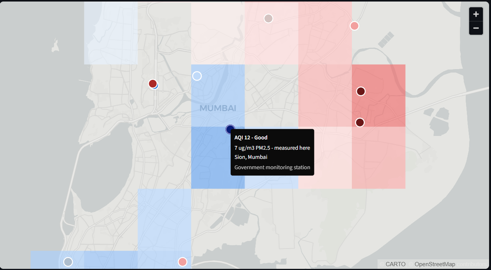

# Mumbai Air Quality

Interactive map of PM2.5 across the Mumbai metropolitan region, interpolating between the region's sparse ground monitors to estimate air quality at locations that have none. It shows current CPCB readings by default and can be rewound to any hour in an 18-month history.

**Live app:** https://mumbai-air-quality.streamlit.app
**Repository:** https://github.com/yash-agx/mumbai-air-quality



---

## The problem

The Mumbai metropolitan region has roughly 20 million people and 39 usable PM2.5 monitors. That is one monitor per half-million people, spaced 1–40 km apart, and they are not spread evenly: they cluster near main roads and industrial land, because that is where regulatory interest sits.

So most of the city has no monitor, and the places without one are not a random sample of the places with one. Estimating what the gaps look like is the entire problem, and how well that can be done is the question this project actually answers — the answer turns out to be "less well than you would hope", for a reason that is measurable.

## Data

| | source | detail |
|---|---|---|
| History | [OpenAQ](https://openaq.org) v3 (republishing CPCB/MPCB/IITM) | 39 stations, 376,131 hourly readings, 2025-02-27 to 2026-08-27 (545 days) |
| Live | [data.gov.in](https://data.gov.in) CPCB real-time feed | current hour, matched to the same 39 stations by coordinates |
| Land use | [OpenStreetMap](https://www.openstreetmap.org) via Overpass | roads, coastline, industrial land use, building footprints |

Cleaning (`data/clean.py`) handles what actually breaks in this data rather than what is tidy to handle: missing hours, monitors offline for days, stuck sensors repeating one value for 24+ unbroken hours, near-coincident stations reported under different names by different agencies, and a residue of sensor artefacts that clear the physical plausibility check. That last one mattered — a saturation value of exactly 985.0 µg/m³ appeared as the maximum at five unrelated monitors, and isolated single-hour spikes appeared while the rest of the city sat at its usual ~23 µg/m³. Screening those two patterns changed RMSE from ~46 µg/m³ to ~21.

Six land-use features are computed per location from OSM (`scripts/02_features.py`), as a reusable function over any latitude/longitude so the same features serve both the 39 monitors and an arbitrary prediction grid: distance to the nearest major road, road density within 500 m and 1 km, distance to the coast, distance to the nearest industrial land use, and building density within 500 m.

## Method

Three models, each given exactly the same information — the readings from every other monitor at the hour being predicted:

- **IDW** — inverse distance weighting. The baseline. Its power is tuned per fold on training monitors only, because the conventional 1/d² is not its best setting here and a deliberately weak baseline would flatter everything else.
- **Kriging** — ordinary kriging on hourly-standardised values with one fitted exponential variogram.
- **Gradient-boosted trees** — on the six OSM features plus hour, day of week, month and the hour's citywide level. (The plan called for a random forest; boosted trees give the same family of model at ~20× the fit speed, which is what made 35 folds tractable.) A fourth variant hands the trees the IDW estimate as an extra input, to test directly whether land use adds anything on top of distance weighting.

**Validation is leave-one-group-out, not leave-one-station-out.** Several monitors sit within a kilometre of each other — two in Bandra East are ~70 m apart. Holding out one while its neighbour trains is not a spatial test: the model reads the answer off the neighbour across the street. Those are grouped, so the 39 monitors form 35 groups that are held out whole. The same rule applies to the inner loop that tunes the IDW power; without it, a 70 m partner leaks into the tuning.

**Where the map refuses to answer.** Each grid cell's six land-use features are compared against the range spanned by all 39 monitors; a cell outside that range on any feature gets no estimate, because nothing in the cross-validation score says what the model does in terrain it never saw. Two deliberate choices in that rule:

- The band is **min–max, not a percentile trim**. With 39 monitors, p01 sits just above the minimum, and 9 monitors fell outside their own band — the mask would have shaded ground where measurements exist.
- **A cell containing a monitor is always in-range**, whatever its features say. The mask flags places with no comparable training data, and a cell with a monitor in it has ground truth by definition. This is not hypothetical: the mask is evaluated at the cell centre, which at 2.3 km cells can sit most of a kilometre from the monitor, and 11 of 39 monitors landed in masked cells — Bandra Kurla Complex was excluded for a road density of 28.99 against a training maximum of 28.98, a margin of 0.035%. A percentage tolerance would have papered over it with an arbitrary number; the monitor rule follows from what the mask is for. It moves coverage from 81.3% masked to 79.8%, and leaves 0 of 39 monitors in a refused cell.

## Results

Pooled over 376,112 held-out station-hours across 35 folds:

| model | MAE (µg/m³) | RMSE (µg/m³) | vs IDW |
|---|---:|---:|---:|
| **IDW** | **11.229** | **21.117** | — |
| Kriging | 11.293 | 21.168 | +0.24% |
| City average | 11.359 | 21.223 | +0.50% |
| Trees + IDW | 11.286 | 21.550 | +2.05% |
| Trees (land use only) | 11.385 | 21.608 | +2.33% |

"City average" is not a model. It is the plain mean of every reporting monitor that hour, included as the floor any spatial method has to clear.

**IDW wins, and nothing beats simply averaging the city by more than 0.5%.** Kriging beats IDW at 12 of 39 monitors; the trees at 13 of 39. Both differences are statistically detectable and practically irrelevant. Adding OSM land-use features made the estimate worse, not better.

## The finding: level is not spatially predictable, but timing is

Two results that only make sense together. They explain the table above, and they point in opposite directions.

### Hourly level: no spatial structure to exploit

Take each hour's readings, subtract that hour's citywide mean and divide by its spread. What remains is the purely spatial pattern with the shared "the whole basin is high tonight" signal removed. That residual field has almost no spatial structure at the distances between monitors:

| separation | pairs | semivariance |
|---|---:|---:|
| ~1.2 km | 10 | **0.96** |
| 3.7 km | 38 | 1.06 |
| 7.7 km | 99 | 1.05 |
| 12.6 km | 130 | 1.09 |
| 17.7 km | 114 | 1.08 |
| 24.4 km | 217 | 1.09 |
| 35.7 km | 133 | 1.07 |

Semivariance ~1.0 means two monitors are no more alike than two picked at random. The curve is flat beyond ~2 km. Even at the closest separation only about a tenth of the variance is spatially structured. The same shape appears in the raw, artefact-screened and log-transformed data, so it is a property of the field and not of outliers.

The closest monitor pairs outside the co-located groups are ~1 km apart and most are 5–40 km. **The correlation is gone before the second-nearest monitor.** There is very little for any interpolation method to exploit, which caps how far any model can get beyond "the city is at X right now" — and kriging in particular cannot beat IDW, because the variogram it fits is nearly pure nugget.

Two honest caveats on that table. The nearest bin rests on 10 pairs, and those are exactly the near-coincident monitors that cross-validation holds out together — so the one bin showing structure is the one deliberately not exploited. And the fitted variogram is correspondingly unstable across folds: median nugget 0.95, range poorly identified anywhere from 2 km to the 300 km bound. That instability is itself the result; there is no well-defined range to find because there is almost nothing to fit.

The map is therefore honestly described as *the city average, tilted slightly* — not a resolved street-level pollution field. The app says so in its own model card panel, and the grid is drawn at ~2.3 km cells rather than a smooth high-resolution raster that would imply more certainty than the data supports.

### Diurnal timing: location-specific, and thrown away

Ask about *when* each place peaks rather than *how high*, and the answer inverts. Averaging each monitor by hour of day, then removing that site's level and swing so only shape remains:

| comparison | median r | IQR |
|---|---:|---|
| Same monitor, independent halves of the record | **0.889** | 0.799–0.956 |
| Two different monitors | **0.504** | 0.259–0.683 |

The first row is a **noise ceiling**, and it is what makes the second row mean anything. A between-monitor correlation of 0.50 proves nothing by itself — profiles built from finite, gappy records are noisy, and removing each site's level and swing amplifies that noise, so 0.50 could be measurement error. Splitting each monitor's own record into odd and even days gives two independent estimates of the *same* profile, where the true shape is identical by construction. Correlating those measures how well a profile can be reproduced at all: r = 0.889. Different monitors reach only 57% of that ceiling (gap +0.385, Mann–Whitney p = 5.6×10⁻²⁰), so locations really do have distinct daily rhythms. A single common shape explains just 32.9% of the variance across the 39 sites, on a median day–night swing of 10.4 µg/m³.

**IDW cannot represent that.** An interpolated series is a fixed-weight average over all reporting monitors, so its diurnal shape is the citywide shape wherever it is computed. Measured at each monitor's own location, against the all-monitor average curve:

| | median r with the city curve |
|---|---:|
| Measured monitor | **0.758** |
| IDW estimate for the same spot | **0.997** |

The estimate reproduces the city's daily rhythm almost exactly and the local one not at all — the same mechanism as the flat variogram, but visible as a shape being flattened rather than a number being close.

**Both halves together are the result.** At this network's spacing the hourly level is not spatially predictable, while diurnal timing is location-specific and reliably measurable — and the interpolation discards the second along with the first. Local timing requires measurement at that location; interpolating between monitors 1–40 km apart will not recover it. The app's time-patterns section plots the measured and estimated curves as separate series so the gap is visible rather than asserted.

## Limitations

**Not all monitors report.** At the last check the live CPCB feed carried 17 of the 39 monitors. The app states how many are reporting and falls back to the most recent stored hour when the feed is unreachable.

**The monitor network is sited unlike the city it measures.** Monitors sit at roughly 2.7× the building density of typical inhabited ground (median 244.5 vs 90.4 buildings/km²) and 2.4× the road density, and the densest monitor lands at the 98th percentile of inhabited cells. Where the model extrapolates, it therefore mostly extrapolates *downward* — into quieter, greener, lower-traffic ground it has never seen. Any estimate for a calm residential pocket rests on monitors systematically busier than it, and nothing in the cross-validation score speaks to that, because every held-out monitor is itself one of these busy sites. Mumbai's dense neighbourhoods are largely inside the training range; the gap is at the quiet end.

**79.8% of the map is masked.** Grid cells whose land use falls outside the range spanned by all 39 monitors get no estimate. At the default resolution that is 458 cells of open water, forest and empty land (the bounding box is a rectangle over a coastal city, and 37% of cells contain no mapped roads or buildings at all), 28 cells that are inhabited but further from a road or industry than any monitor, and 13 for other reasons. The second group is the one worth knowing about; the app can colour the mask by reason.

**The AQI figures are hourly, not official.** CPCB defines the National Air Quality Index on a 24-hour average. The app applies CPCB's published PM2.5 breakpoints to a single hour, so the scale and category names are CPCB's but the number is not the official daily AQI and moves around more.

**Uncertainty scales with concentration, not distance.** Error against distance-to-nearest-monitor measured r = −0.02 — being far from a monitor is not by itself a reason to distrust a cell. The error bar is calibrated on held-out monitors as a function of the predicted level instead.

**113 readings above 500 µg/m³ survive the artefact screen**, kept because the citywide median cleared the corroboration threshold that hour. Some are genuine episodes; a few clear the bar narrowly. See `NOTES.md`.

## Running it locally

Requires Python ≥3.11 (pandas 3.x and numpy 2.x).

```bash
git clone https://github.com/yash-agx/mumbai-air-quality.git
cd mumbai-air-quality
python -m venv .venv && source .venv/bin/activate    # Windows: .venv\Scripts\activate
pip install -r requirements.txt
streamlit run app.py
```

The cleaned data, model card and precomputed masks are committed (~1.3 MB), so the app runs immediately without rebuilding anything.

For the **live view**, add a [data.gov.in](https://data.gov.in) API key to a `.env` file in the project root. Without it the app opens on the most recent stored hour and says so.

```
DATAGOV_API_KEY=your-key-here
```

The key must be authorised for dataset access, not just registered — an unauthorised key returns `403 Key not authorised` and the app falls back with that message.

### Rebuilding the data pipeline

Only needed to refresh the history or change the feature set. Requires the extra dependencies and an [OpenAQ](https://openaq.org) key in `.env` as `OPENAQ_API_KEY`.

```bash
pip install -r requirements-dev.txt
python data/fetch.py            # OpenAQ pull -> data/raw/       (~10 min)
python data/clean.py            # clean + quality report -> data/processed/
python scripts/02_features.py   # OSM features via Overpass -> data/interim/
python model/interpolate.py     # cross-validation + model card (~6 min)
python model/interpolate.py --masks   # bake extrapolation masks for the app
```

The masks step is what keeps deployment small: it reduces 41 MB of OSM point clouds to a 2.7 KB file, because the mask answers a question whose answer never changes. The deployed app never loads OSM at all.

## Repository layout

```
app.py                     Streamlit dashboard
data/fetch.py              OpenAQ historical pull
data/clean.py              cleaning, artefact screen, quality report
data/live.py               data.gov.in live CPCB feed
scripts/01_check_api.py    API reconnaissance
scripts/02_features.py     OSM land-use features for any lat/lon
model/interpolate.py       IDW / kriging / trees, spatial CV, predict_surface
NOTES.md                   decisions, open questions, findings in full
```

`NOTES.md` carries the reasoning behind the choices here, including the ones that changed a conclusion — a weak IDW baseline that made kriging look like a winner, and a leak in the hyperparameter tuning that the group structure had to close.
